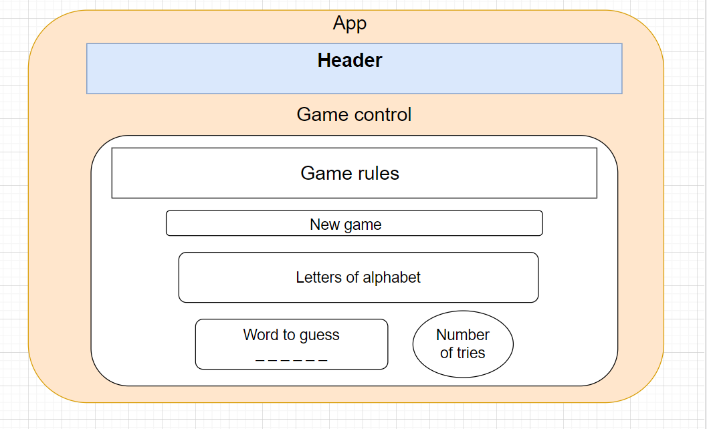

# Wordpuzzle game

#### By: Viktoria Zubarieva

#### Description

## Technologies Used

- React
- JavaScript
-
-

## Setup/Installation Requirements

- _Clone repository from GitHub_
- _Open your terminal and run the command $ git clone https://github.com/vzubarieva/coffee-shop_
- Navigate to "wordpuzzle": $ cd wordpuzzle
- Open in code editor (VS Code)
- Install dependencies: $ npm install
- Run Program $ npm run start ( It should open the server http://localhost:3000/ )

## Known Bugs

-

## License

_MIT_

Copyright (c) _2022_ _Viktoriia Zubarieva_
